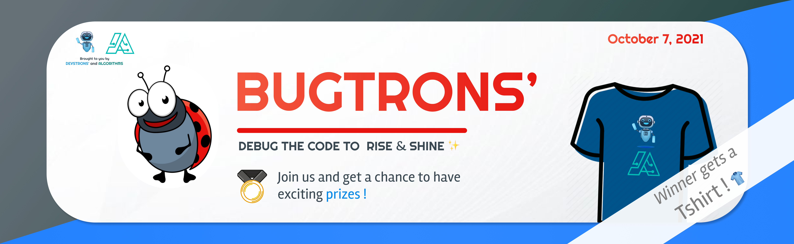

  <h1 align="center"> 🐞 BUGTRONS </h1>

 

  <h4 align="center"> DEBUG THE CODE TO RISE & SHINE ✨ </h4>

 

    

  <h2 align="center"> 🤔 ABOUT </h2>

#### The BUGTRONS is a student-run contest, organized with the collaboration of two tremendous tech-lead communities:-

- [DEVSTRONS'](https://twitter.com/devstrons): Student-run Open source/ project-based, inclusive & diverse community intending to Learn, Code and Tron (grow).
- [THE ALGORITHMS](https://github.com/TheAlgorithms): Open Source resource for learning Data Structures & Algorithms and their implementation in any Programming Language

> **"Competition makes us faster. Collaboration makes us better"**

We believe in open source for everyone, and coding ability enhances the folks development among communities.

  <h2 align="center"> 🏗 STRUCTURE:-</h2>
 

Three-Tier, Multi-Division contest, and Coding Rounds  
See individual show addendums for tier-two multi-division contest, after competed & cleared the round for tier-one. 
 

  <h1 align="center"> ⚡ PARTICIPATION GUIDELINES</h1>

Rules and regulations help hackers understand what is expected of them & make sure to follow the [instructions](https://github.com/devstrons/bugtrons/blob/main/participation-guidelines.md) without violating them.

  <h2 align="center"> 📰 CODE OF CONDUCT </h2>

Every participant is requested to abide by the [Code of Conduct](https://github.com/devstrons/bugtrons/blob/main/CODE_OF_CONDUCT.md). Failure to do so will result in immediate disqualification.

 

  <h2 align="center">👕 PERKS & GIVEAWAYS </h2>

 

All divisions will be judge simultaneously. Top 3 Hackers will be awarded as below:

 

    

| **POSITION** | **SWAGS** |
| :---:         | :---:           |
| Top 10 (**TIER-TWO**) | **Certificate of Appreciation** |
| Rank 3rd     | **Certificate for stand 3rd** |
| Rank 2nd     | **Stickers' pack** & Certificate for stand 2nd |
| Rank 1ST     | **T-Shirt** & Certificate for 1st position |

